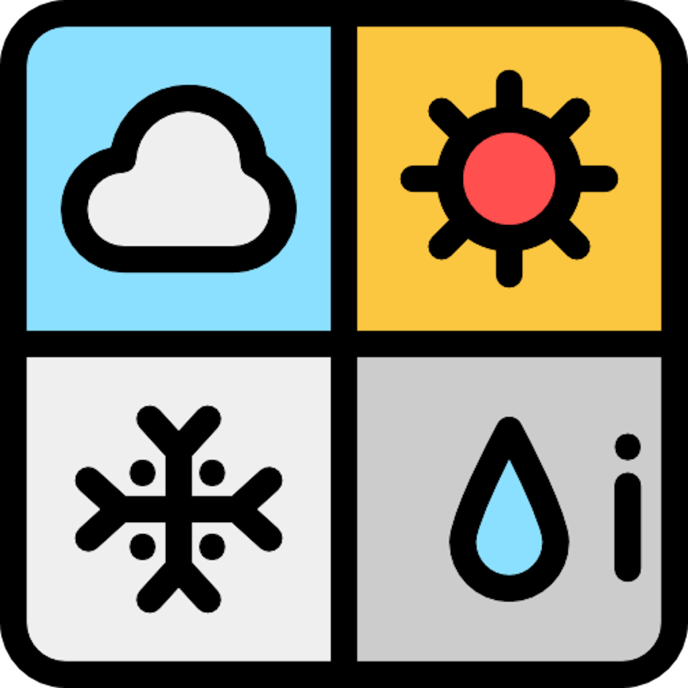

<a name="readme-top"></a>

<!-- PROJECT SHIELDS -->
[![Contributors][contributors-shield]][contributors-url]
[![Forks][forks-shield]][forks-url]
[![Stargazers][stars-shield]][stars-url]
[![Issues][issues-shield]][issues-url]
[![MIT License][license-shield]][license-url]
[![LinkedIn][linkedin-shield]][linkedin-url]


<!-- PROJECT LOGO -->
<br />
<div align="center">
  <a href="https://github.com/junseo-yang/ootd">
    
  </a>

  <h3 align="center">ootd</h3>

  <p align="center">
    An iOS app to get outfit of the day and weather forecast!
    <br />
    <a href="https://www.tomorrow.io/">#weather</a>
    <a href="https://www.instagram.com/explore/tags/ootd/">#ootd</a>
    <br />
    <a href="https://github.com/junseo-yang/ootd"><strong>Explore the docs »</strong></a>
    <br />
    <br />
    <a href="https://github.com/junseo-yang/ootd">View Demo</a>
    ·
    <a href="https://github.com/junseo-yang/ootd/issues">Report Bug</a>
    ·
    <a href="https://github.com/junseo-yang/ootd/issues">Request Feature</a>
  </p>
</div>


<!-- TABLE OF CONTENTS -->
<details>
  <summary>Table of Contents</summary>
  <ol>
    <li>
      <a href="#about-the-project">About The Project</a>
      <ul>
        <li><a href="#built-with">Built With</a></li>
      </ul>
    </li>
    <li>
      <a href="#getting-started">Getting Started</a>
      <ul>
        <li><a href="#prerequisites">Prerequisites</a></li>
        <li><a href="#installation">Installation</a></li>
      </ul>
    </li>
    <li><a href="#usage">Usage</a></li>
    <li><a href="#roadmap">Roadmap</a></li>
    <li><a href="#contributing">Contributing</a></li>
    <li><a href="#license">License</a></li>
    <li><a href="#contact">Contact</a></li>
  </ol>
</details>


<!-- ABOUT THE PROJECT -->
## About The Project

**ootd** is an iOS app to get the outfit of the day and weather forecast! It suggests [#ootd](https://www.instagram.com/explore/tags/ootd/)(outfit of the day) based on your location and outdoor temperature.

[![ootd screenshot Home][screenshot-home]](https://github.com/junseo-yang/ootd)

<p align="right">(<a href="#readme-top">back to top</a>)</p>


### Built With
* [![Swift][Swift]][Swift-url]

<p align="right">(<a href="#readme-top">back to top</a>)</p>


<!-- GETTING STARTED -->
## Getting Started

This is an example of how you may give instructions on setting up your project locally.
To get a local copy up and running follow these simple example steps.

### Prerequisites

1. macOS 13.4.1
2. Xcode 14.3.1
3. iOS 16.0

### Installation

1. Clone the repo
    ```sh
    git clone https://github.com/junseo-yang/ootd.git
    ```
2. open xcodeproject
    ```sh
    open WeatherApp.xcodeproj
    ```
3. Run the Application

<p align="right">(<a href="#readme-top">back to top</a>)</p>


<!-- USAGE EXAMPLES -->
## Usage
1. Get weather forecast!
2. Get ootd suggestion!

<p align="right">(<a href="#readme-top">back to top</a>)</p>


<!-- ROADMAP -->
## Roadmap

- [x] Implement weather forecast feature with tomorrow.io API
- [ ] Implement ootd suggestion workflow

See the [open issues](https://github.com/junseo-yang/ootd/issues) for a full list of proposed features (and known issues).

<p align="right">(<a href="#readme-top">back to top</a>)</p>


<!-- CONTRIBUTING -->
## Contributing

Contributions are what make the open source community such an amazing place to learn, inspire, and create. Any contributions you make are **greatly appreciated**.

If you have a suggestion that would make this better, please fork the repo and create a pull request. You can also simply open an issue with the tag "enhancement".
Don't forget to give the project a star! Thanks again!

1. Fork the Project
2. Create your Feature Branch (`git checkout -b feature/AmazingFeature`)
3. Commit your Changes (`git commit -m 'Add some AmazingFeature'`)
4. Push to the Branch (`git push origin feature/AmazingFeature`)
5. Open a Pull Request

<p align="right">(<a href="#readme-top">back to top</a>)</p>


<!-- LICENSE -->
## License

Distributed under the MIT License. See `LICENSE.txt` for more information.

<p align="right">(<a href="#readme-top">back to top</a>)</p>


<!-- CONTACT -->
## Contact

**Junseo Yang**
- :briefcase: LinkedIn: https://linkedin.com/in/junseo-yang
- :school_satchel: Website: https://junseo-yang.github.io
- :mailbox: jsy724724@gmail.com

Project Link: [https://github.com/junseo-yang/ootd](https://github.com/junseo-yang/ootd)

<p align="right">(<a href="#readme-top">back to top</a>)</p>


<!-- MARKDOWN LINKS & IMAGES -->
<!-- https://www.markdownguide.org/basic-syntax/#reference-style-links -->
[contributors-shield]: https://img.shields.io/github/contributors/junseo-yang/ootd.svg?style=for-the-badge
[contributors-url]: https://github.com/junseo-yang/ootd/graphs/contributors
[forks-shield]: https://img.shields.io/github/forks/junseo-yang/ootd.svg?style=for-the-badge
[forks-url]: https://github.com/junseo-yang/ootd/network/members
[stars-shield]: https://img.shields.io/github/stars/junseo-yang/ootd.svg?style=for-the-badge
[stars-url]: https://github.com/junseo-yang/ootd/stargazers
[issues-shield]: https://img.shields.io/github/issues/junseo-yang/ootd.svg?style=for-the-badge
[issues-url]: https://github.com/junseo-yang/ootd/issues
[license-shield]: https://img.shields.io/github/license/junseo-yang/ootd.svg?style=for-the-badge
[license-url]: https://github.com/junseo-yang/ootd/blob/main/LICENSE.txt
[linkedin-shield]: https://img.shields.io/badge/-LinkedIn-black.svg?style=for-the-badge&logo=linkedin&colorB=555
[linkedin-url]: https://linkedin.com/in/junseo-yang
[Swift]: https://img.shields.io/badge/Swift-FA7343?style=for-the-badge&logo=swift&logoColor=white
[Swift-url]: https://developer.apple.com/xcode/swiftui/
[screenshot-home]: images/home.png

## Reference
* https://betterprogramming.pub/simple-weather-app-with-swiftui-ac41200a9d4d
* https://app.tomorrow.io/
* https://schwiftyui.com/swiftui/building-a-widget-for-ios-with-swiftui-and-widgetkit/
* https://github.com/SchwiftyUI/ApodWidget
